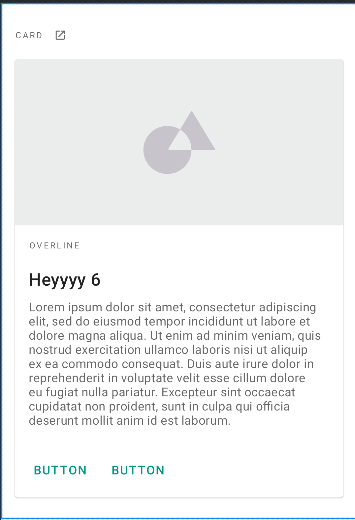
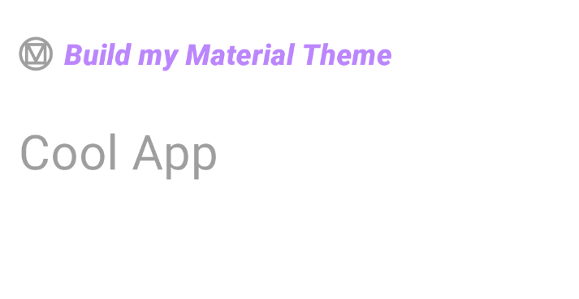
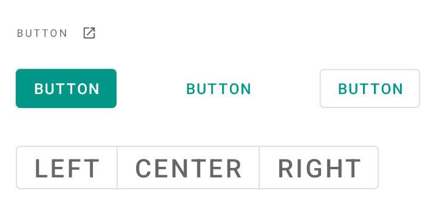
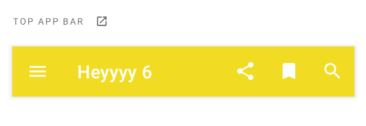

## MODIFICACIONES:

### Hemos cambiado el texto de headline 6

[values/strings.xml](https://github.com/Nereare4/MyMaterialWorld/blob/develop/app/src/main/res/values/strings.xml)
[layout/component_card](https://github.com/Nereare4/MyMaterialWorld/blob/develop/app/src/main/res/layout/component_cards.xml)

### Hemos cambiado el color del texto 

[layout/activity_main](https://github.com/Nereare4/MyMaterialWorld/blob/develop/app/src/main/res/layout/activity_main.xml)

### Hemos cambiado el tamaño en los botones

[layout/component_buttons](https://github.com/Nereare4/MyMaterialWorld/blob/develop/app/src/main/res/layout/component_buttons.xml)

### Hemos cambiado el color de fondo y el texto del botón

[layout/component_dialog](https://github.com/Nereare4/MyMaterialWorld/blob/develop/app/src/main/res/layout/component_dialog.xml)

### Hemos cambiado color de un botón

[layout/component_fabs](https://github.com/Nereare4/MyMaterialWorld/blob/develop/app/src/main/res/layout/component_fabs.xml)

### Hemos cambiado el color del botón

[layout/component_tabs](https://github.com/Nereare4/MyMaterialWorld/blob/develop/app/src/main/res/layout/component_tabs.xml)

### Hemos cambiado el color del botón

[values/color](https://github.com/Nereare4/MyMaterialWorld/blob/develop/app/src/main/res/values/color.xml)
[layout/component_top_app_bar](https://github.com/Nereare4/MyMaterialWorld/blob/develop/app/src/main/res/layout/component_top_app_bar.xml)


## Build a Material Theme
Build a Material Theme lets you create your own Material theme by customizing values for color, typography, and shape. See how these values appear when applied to Material Components and discover how to implement your custom theme in your own projects. Build a Material Theme is also available for the web as a remixable project on [Glitch](https://glitch.com/~material-theme-builder).

## Overview
Material Components for Android supports Material Theming by exposing top level theme attributes for color, typography and shape. Customizing these attributes will apply your custom theme throughout your entire app. 

This project shows how you can organize and use your theme and style resources to take advantage of the robust support for theming in Material Components for Android.

## Change values for typography, shape, and color
By default, apps built with Material Components inherit our baseline theme values. To begin customizing, override properties in `color.xml`, `type.xml` and `shape.xml`. Each file includes detailed comments that illustrate how each subsystem can be customized.

### type.xml
To change your theme’s typography, we recommend using [Google Fonts](https://fonts.google.com/) and choosing a font family that best reflects your style. Set TextApperances to use your custom font and additional type properties to apply a custom type scale globally. [Learn how to add fonts in Android Studio](https://developer.android.com/guide/topics/ui/look-and-feel/downloadable-fonts)

### shape.xml
To systematically apply shape throughout your app, it helps to understand that components are grouped by size into categories of small, medium and large. The shape of each component size group can be themed by customizing its ShapeApperance style.  We recommend using our [shape customization tool](https://material.io/design/shape/about-shape.html#shape-customization-tool) to help you pick your corner family and size values.

### color.xml
To change your theme's color scheme, replace the existing HEX color values with your custom HEX values. This project has both light and dark themes, toggle between them within the app to see your changes. Use our [color palette generator](https://material.io/design/color/the-color-system.html#tools-for-picking-colors) to help come up with pairings and check your color contrast.

## Get Started
Clone the material-components-android-examples repository 

```
git clone https://github.com/material-components/material-components-android-examples.git
```

In Android Studio - Choose ‘Open an existing Android Studio Project’ and select ‘material-components-android-examples/MaterialThemeBuilder’

Sync, build and run the project. The project, by default, will be configured with the baseline Material theme.

Under the ‘res’ folder, open `color.xml`, `type.xml` and `shape.xml`. Each file has detailed comments describing the Material subsystem it controls. Try modifying each subsystem, re-running the app and seeing how changes are propagated throughout the app.

Once you build your Material theme, move the theme resources (`color.xml`, `type.xml`, `shape.xml`, `styles.xml`, `themes.xml` and `night/themes.xml`) over to your app to start using your Material theme in your own projects.
